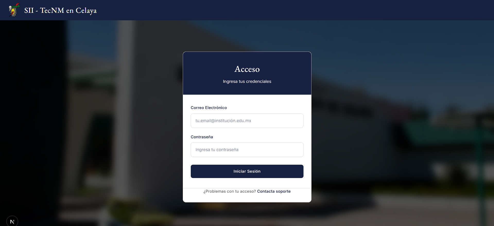

# Portal Estudiante SII - TecNM Celaya

Portal web integral para estudiantes del Tecnológico Nacional de México en Celaya. Permite consultar información académica en tiempo real incluyendo calificaciones, horarios de clases, historial académico (kardex) y una calculadora de promedio proyectado.

## 📋 Tabla de Contenidos

- [Descripción General](#descripción-general)
- [Stack Tecnológico](#stack-tecnológico)
- [Requisitos Previos](#requisitos-previos)
- [Instalación](#instalación)
- [Ejecución](#ejecución)
- [Estructura del Proyecto](#estructura-del-proyecto)
- [Características Principales](#características-principales)
- [Guía de Desarrollo](#guía-de-desarrollo)
- [Capturas de Pantalla](#capturas-de-pantalla)

## Descripción General

Este portal proporciona a los estudiantes del TecNM en Celaya una interfaz moderna y responsiva para:

- **Visualizar calificaciones** por semestre y materia
- **Consultar horario** de clases en tiempo real
- **Revisar kardex** (historial académico completo)
- **Calcular promedio proyectado** con simulación de calificaciones futuras
- **Ver información personal** del perfil estudiantil incluyendo foto, semestre, créditos y promedio

## 🛠️ Stack Tecnológico

| Tecnología | Versión | Descripción |
|---|---|---|
| **Next.js** | 16.2.4 | Framework React con SSR y App Router |
| **React** | 19.2.4 | Librería de interfaz de usuario |
| **TypeScript** | 5.x | Lenguaje con tipado estático |
| **Tailwind CSS** | 4.x | Framework CSS utilitario |
| **Node.js** | 18+ | Runtime JavaScript |

### Dependencias Clave
- `next`: Framework fullstack
- `react`: Librería de UI
- `typescript`: Tipado estático

## 📦 Requisitos Previos

Antes de comenzar, asegúrate de tener instalado:

- **Node.js** >= 18.0.0 ([Descargar](https://nodejs.org/))
- **npm** >= 9.0.0 (incluido con Node.js)
- **Git** para control de versiones

### Verificar Instalación

```bash
node --version    # Debe mostrar v18.0.0 o superior
npm --version     # Debe mostrar 9.0.0 o superior
```

## 🚀 Instalación

### 1. Clonar el Repositorio

```bash
git clone <URL_DEL_REPOSITORIO>
cd frontend-sii
```

### 2. Instalar Dependencias

```bash
npm install
```

Este comando instalará todos los paquetes necesarios listados en `package.json`.

### 3. Configurar Variables de Entorno

Crea un archivo `.env.local` en la raíz del proyecto:

```env
# API Base URL (si es necesario personalizar)
NEXT_PUBLIC_API_BASE_URL=https://sii.celaya.tecnm.mx/api
```

## ⚙️ Ejecución

### Modo Desarrollo

Inicia el servidor de desarrollo con hot reload:

```bash
npm run dev
```

El aplicativo estará disponible en: **[http://localhost:3000](http://localhost:3000)**

### Modo Producción

Compilar para producción:

```bash
npm run build
```

Ejecutar en modo producción:

```bash
npm start
```

### Otros Comandos Útiles

```bash
# Linting con ESLint
npm run lint

# Build y análisis
npm run build

# Limpiar cache
npm run clean
```

## 📁 Estructura del Proyecto

```
frontend-sii/
├── app/                          # Directorio de App Router (Next.js)
│   ├── layout.tsx               # Layout raíz de la aplicación
│   ├── page.tsx                 # Página inicial
│   ├── globals.css              # Estilos globales
│   ├── login/                   # Página de autenticación
│   │   └── page.tsx
│   ├── dashboard/               # Panel principal (protegido)
│   │   └── page.tsx
│   ├── calificaciones/          # Vista de calificaciones (protegido)
│   │   └── page.tsx
│   ├── horario/                 # Horario de clases (protegido)
│   │   └── page.tsx
│   ├── kardex/                  # Historial académico (protegido)
│   │   └── page.tsx
│   ├── calculadora/             # Calculadora de promedio (protegido)
│   │   └── page.tsx
│   └── api/                     # Rutas API
│       └── calculadora/
│           └── route.ts         # Endpoint para simulaciones
│
├── hooks/                        # React Hooks personalizados
│   ├── useAuth.ts               # Gestión de autenticación (JWT)
│   └── useProfile.ts            # Carga de perfil estudiantil
│
├── services/                     # Servicios/utilidades API
│   ├── authService.ts           # Login y JWT token
│   ├── studentService.ts        # Datos académicos
│   ├── calificacionesService.ts # Calificaciones
│   └── calculadoraService.ts    # Calculadora de promedio
│
├── public/                       # Archivos estáticos
│   └── images/
│       └── logo-itc.png         # Logo del Instituto
│
├── proxy.ts                      # Middleware de protección de rutas
├── next.config.ts               # Configuración de Next.js
├── tsconfig.json                # Configuración de TypeScript
├── tailwind.config.ts           # Configuración de Tailwind CSS
├── package.json                 # Dependencias del proyecto
└── README.md                     # Este archivo
```

## ✨ Características Principales

### 🔐 Autenticación
- **Login seguro** con credenciales estudiantiles
- **Tokens JWT** almacenados en cookies HTTP-only
- **Redirección automática** a login si no estás autenticado
- **Logout seguro** que limpia sesiones

### 📊 Dashboard
- **Bienvenida personalizada** con nombre del estudiante
- **Foto de perfil** desde base de datos
- **Estadísticas académicas**:
  - Semestre actual
  - Créditos acumulados
  - Promedio ponderado
  - Porcentaje de avance
- **Tarjetas informativas** con resumen académico

### 📈 Calificaciones
- **Vista por semestre** con todas las materias
- **Detalles por materia**: nombre, créditos, calificación
- **Clasificación visual** de calificaciones (aprobado/reprobado)
- **Filtrado y búsqueda** de materias

### 📅 Horario
- **Horario semanal** completo
- **Detalles por clase**: materia, profesor, sala, hora
- **Visualización clara** de conflictos horarios
- **Interfaz responsiva** para dispositivos móviles

### 📚 Kardex
- **Historial académico completo**
- **Materias cursadas por semestre**
- **Análisis de desempeño** a lo largo del tiempo
- **Información de aprobación y reprobación**

### 🧮 Calculadora de Promedio
- **Simular calificaciones futuras**
- **Proyectar promedio** con diferentes escenarios
- **Impacto en promedio** de nuevas calificaciones
- **Validación en tiempo real**

## 🔧 Guía de Desarrollo

### Sistema de Autenticación

El sistema usa **JWT (JSON Web Tokens)** almacenados en cookies:

```typescript
// En useAuth.ts
const { token, isAuthenticated, login, logout } = useAuth();
```

### Llamadas API

Las llamadas se hacen a través de servicios centralizados:

```typescript
// Ejemplo: obtener calificaciones
const { calificaciones } = await studentService.getCalificaciones();
```

### Componentes Reutilizables

Aunque el proyecto usa estilos inline principalmente, puedes crear componentes reutilizables:

```typescript
// Ejemplo de patrón usado en el proyecto
const Navbar = () => (
  <nav style={{ /* estilos */ }}>
    {/* contenido */}
  </nav>
);
```

### Protección de Rutas

El archivo `proxy.ts` implementa un middleware que:
- Valida la presencia de token JWT
- Redirige al login si no está autenticado
- Carga automáticamente datos del perfil

## Capturas de Pantalla

### Pantalla de Login

*Interfaz de autenticación segura con credenciales institucionales*


### Dashboard Principal

*Panel de inicio con información resumida del estudiante y estadísticas académicas*

### Vista de Calificaciones

*Listado detallado de materias cursadas y sus calificaciones por semestre*

### Horario de Clases

*Calendario semanal con horario de clases, profesor y ubicación*

### Kardex Académico

*Historial completo de materias cursadas a lo largo de la carrera*

### Calculadora de Promedio

*Herramienta para simular y proyectar promedio con diferentes escenarios*

## 🌐 API Base

**URL Base**: `https://sii.celaya.tecnm.mx/api`

### Endpoints Principales

- `POST /login` - Autenticación
- `GET /estudiante/perfil` - Datos del estudiante
- `GET /estudiante/calificaciones` - Calificaciones
- `GET /estudiante/horario` - Horario de clases
- `GET /estudiante/kardex` - Historial académico

## 📝 Variables de Entorno

```env
# Desarrollo
NEXT_PUBLIC_API_BASE_URL=https://sii.celaya.tecnm.mx/api

# Producción (se puede sobrescribir)
NEXT_PUBLIC_API_BASE_URL=https://sii.celaya.tecnm.mx/api
```

## 🐛 Solución de Problemas

### Error: "CORS not allowed"
- Verifica que el proxy en `next.config.ts` esté configurado correctamente
- Asegúrate que la API base URL es correcta

### Error: "Token expirado"
- El token JWT ha expirado
- Haz logout y vuelve a hacer login

### Datos no se cargan en Dashboard
- Verifica que tienes conexión a internet
- Abre la consola del navegador (F12) para ver errores específicos
- Verifica que el token es válido

## 📞 Soporte

Para reportar bugs o solicitar funcionalidades:
- Crea un issue en el repositorio
- Contacta al equipo de desarrollo

## 📄 Licencia

Este proyecto es propiedad del Tecnológico Nacional de México en Celaya.

## 🔄 Control de Versiones

```bash
# Ver historial de cambios
git log --oneline

# Ver cambios actuales
git status

# Hacer commit de cambios
git add .
git commit -m "Descripción de cambios"
git push origin main
```

---

**Última actualización**: Abril 2026  
**Versión**: 1.0.0  
**Desarrollador**: Equipo Frontend
